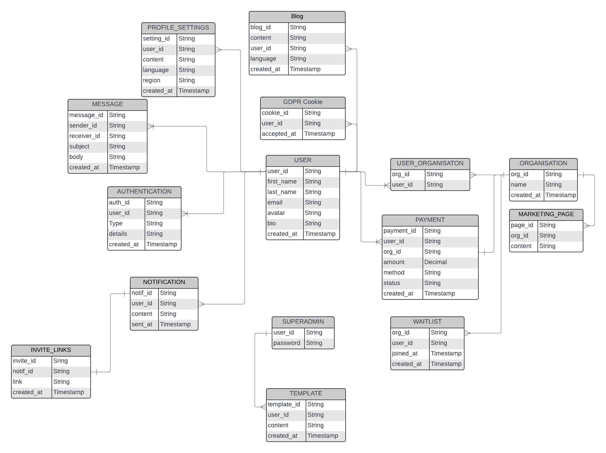

# Teamhawk Integration Documentation

## Overview

This repository contains our backend API which is designed for a comprehensive platform to handle featurs such as user authentication, organisation managements, payments, notifications, messages and much more.

## Folder Structure

```
|--- src
|    |--- controllers
|    |--- database
|    |--- interfaces
|    |--- middlewares
|    |--- routes
|    |--- services
|    |--- utils
|    |--- server.ts
|--- .env
|--- app.ts
|--- .gitignore
|--- package.json
|--- tsconfig.json
```

## Dependencies (Dev)

- Node.js
- TypeScript
- Express
- ts-node-dev
- [Other dependencies]

## Getting Started

Before you begin, ensure you have the following installed on your machine:

- [Node.js](https://nodejs.org/) (v14 or later)
- [npm](https://www.npmjs.com/) (Node Package Manager, included with Node.js)
- [Git](https://git-scm.com/)

## Contribution Guide

## Getting Started

#### If you don't have git on your machine, [install it](https://docs.github.com/en/get-started/quickstart/set-up-git).

## Fork this repository

Fork this repository by clicking on the fork button on the top of this page.
This will create a copy of this repository in your account.

## Clone the repository


Now clone the forked repository to your machine. Go to your GitHub account, open the forked repository, click on the code button and then click the _copy to clipboard_ icon.

Open a terminal and run the following git command:

```bash
git clone "url you just copied"
```

where "url you just copied" (without the quotation marks) is the url to this repository (your fork of this project). See the previous steps to obtain the url.


For example:

```bash
git clone git@github.com:this-is-you/first-contributions.git
```

where `this-is-you` is your GitHub username. Here you're copying the contents of the first-contributions repository on GitHub to your computer.

## Create a branch

Change to the repository directory on your computer (if you are not already there):

```bash
cd first-contributions
```

Now create a branch using the `git switch` command:

```bash
git switch -c your-new-branch-name
```

For example:

```bash
git switch -c add-alonzo-church
```

### Make Changes

Make your changes to the codebase. Ensure your code follows the project's coding standards and guidelines.

### Run Tests

Run the existing tests to ensure your changes do not break anything. If you added new functionality, write corresponding tests.

```sh
npm run test
```

## commit those changes

Now open `Contributors.md` file in a text editor, add your name to it. Don't add it at the beginning or end of the file. Put it anywhere in between. Now, save the file.


If you go to the project directory and execute the command `git status`, you'll see there are changes.

Add those changes to the branch you just created using the `git add` command:

## Push changes to GitHub

Push your changes using the command `git push`:

```bash
git push -u origin your-branch-name
```

replacing `your-branch-name` with the name of the branch you created earlier.

<details>
<summary> <strong>If you get any errors while pushing, click here:</strong> </summary>

- ### Authentication Error
     <pre>remote: Support for password authentication was removed on August 13, 2021. Please use a personal access token instead.
  remote: Please see https://github.blog/2020-12-15-token-authentication-requirements-for-git-operations/ for more information.
  fatal: Authentication failed for 'https://github.com/<your-username>/first-contributions.git/'</pre>
  Go to [GitHub's tutorial](https://docs.github.com/en/authentication/connecting-to-github-with-ssh/adding-a-new-ssh-key-to-your-github-account) on generating and configuring an SSH key to your account.

</details>

## Submit your changes for review into Staging

If you go to your repository on GitHub, you'll see a `Compare & pull request` button. Click on that button.


Now submit the pull request.


Soon your changes will be merged into the staging branch of this project. You will get a notification email once the changes have been merged.

## Setup Instructions

### 1. Clone the Repository

First, clone the repository to your local machine using Git.

```sh
git clone https://github.com/your-username/[app-name].git
cd [app-name]
```

### 2. Install Dependencies

Navigate to the project directory and install the required dependencies.

```sh
npm install
```

### 3. Configure Environment Variables

Create a `.env` file in the root directory of the project and add your environment-specific variables. You can use the provided `.env.example` file as a reference.

```sh
cp .env.example .env
```

Edit the `.env` file to match your environment configuration.

### 4. Compile TypeScript

Compile the TypeScript code to JavaScript.

```sh
npm run build
```

### 5. Run the Development Server

Start the development server with the following command. This will also watch for any changes in your code and automatically restart the server.

```sh
npm run start:dev
```

### 6. Run the Production Server

To run the application in a production environment, use the following command:

```sh
npm run start
```

### 7. Verify the Setup

Open your browser and navigate to `http://localhost:3000/api/v1/` to verify that the application is running correctly.

## Folder Structure

Here's an overview of the project's folder structure:

```
|--- src
|    |--- controllers
          |--- v1
|    |--- database
|    |--- interfaces
|    |--- middlewares
|    |--- routes
|         |--- v1
|    |--- services
|    |--- utils
|    |--- server.ts
|--- .env
|--- app.ts
|--- .gitignore
|--- package.json
|--- tsconfig.json
```

## Scripts

Here are some useful npm scripts that you can use during development and production:

- `npm run build`: Compiles the TypeScript code to JavaScript.
- `npm run start:dev`: Starts the development server with live reloading.
- `npm run start`: Starts the production server.
- `npm run test`: Runs the test suite (if available).
- `npm run lint`: Runs the linter to check for code style issues.

## Additional Resources

- [Node.js Documentation](https://nodejs.org/en/docs/)
- [TypeScript Documentation](https://www.typescriptlang.org/docs/)
- [Express Documentation](https://expressjs.com/)

By following these steps, you should have your Node.js and TypeScript application up and running. If you encounter any issues, please refer to the documentation of the respective tools or seek help from the community.

## API Endpoints

All API endpoints can be referenced in the [API Reference](API_REFERENCE.md) document.

## API Specification
The API specifiations can be referenced at [API Specification](https://teamhawks-api-ui.vercel.app/)

## Database Blueprint
The database blueprint for this api is avaliable below



The relationship between the entities are as follows:
- **User and Blog:** One user has many blogs; 1:M
- **User and GDPRCookie:** One user has many GDPR Cookies; 1:M
- **User and ProfileSettings:** One user has many Profile Settings; 1:M
- **User and Message:** One user has one or more messages; 1:1..*
- **User and Authentication:** One user has one or more authentications; 1:1..*
- **User and Notification:** One user has many notifications; 1:M
- **Notification and InviteLinks:** One Notification contains one invite link; 1:1
- **User and Payment:** One user has many payments; 1:M
- **Payment and Organisation:** One payment belongs to one organisation; 1:1
- **Organisation and Waitlist:** One Organisation has many Waitlist; M:N
- **Organisation and MarketingPages:** One Organisation user has many Marketing Pages; 1:M
- **Superadmin and Template:** One Superadmin has many templates; 1:M

## Versioning

This project is versioned to ensure backward compatibility and easy maintenance. The current version is 1.0.0
